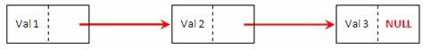

# Liste chainée 
<br>


## 1. Définition :

Une liste chaînée : est une structure de données utilisée en informatique pour organiser et stocker des éléments de manière séquentielle. 
<br>
Elle se compose d'une séquence d'éléments, appelés nœuds , qui sont liés les uns aux autres par des références.
<br>
Chaque nœud contient une valeur (ou une donnée) et un pointeur (ou une référence) vers le nœud suivant dans la séquence. 
<br>
Le dernier nœud de la liste pointe vers une référence nulle pour indiquer la fin de la liste.



<br>
<br>

***RQ*** : <br>
il existe plusieurs type de liste chainée : liste chainée simple , liste chainée circulauire ....etc 

Dans la suite de ce cour on implémente la strcute de liste chainée simple.

## 2. Défintion de liste chainée en C :


```c
// On definit la structure de liste chainée : lch
typedef struct bloc
{
    /* data */
    int val;
    struct bloc *suiv;

} liste;
```

## 3. les fonctionnalités

<br>

Dans ce cour on va implémenter ce structure en C avec différents fonctions:

* afficher le contenu d'une liste chainée : 
    * void AfficheListe(liste* tete);
    * void AfficherlisteRec(liste* tete);
    * void AfficherListeRecInverse(liste* tete);

* Modifier le contenu d'une liste chainée : 
    * liste* ModifierTete(liste* tete, int val);
    * liste* InsererMilieu(liste* tete , int valeur);
    * liste* InsererFin(lsite* tete , int val);
    * lsite* InsererFinRec(liste* tete , int valeur);
    * liste* SupprimerElt(liste* tete , int valeur );

* Concaténation de deux listes chainées  : 
    * liste* Concat2Listes(liste* tete1 , liste* tete2);
    * liste* Concat2listesSansRep(listee* tete1 , liste* tete2);

* Comparaison de deux listes chainées : 
    * void compare(liste* tete1 , liste* tete2);

* Fusion de deux listes chainées : 
    * liste* fusionner(liste* tete1 , liste* tete2);
    * liste* fusionnerRec(lsite* tete1 , liste* tete2);
    * liste* fusionnerSansRep(liste* tete1 , liste* tete2);
    * liste* fusionnerSansRepRec(liste* tete1 , liste* tete2);

* fonctions connexes  : 
    * bool existe(liste*  tete , int val);
    * int somme(liste* tete);
    * int longueur(liste* tete);
    * int nb_elem_diff(liste* tete);