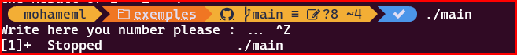
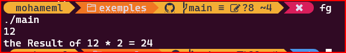
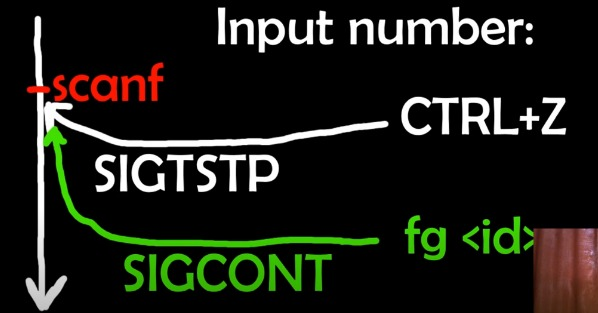

# cour 08 


## 1. Introduction :

- les processus d'un système d'exploitation basé sur Unix, comme Linux, sont classés en deux catégories principales : 
    - les processus en arrière-plan (background processes) et
    - les processus en premier plan (foreground processes).

- Ces catégories sont liées à la manière dont les processus interagissent avec l'utilisateur et le terminal.

    1. **Processus en Premier Plan :**
    - Un processus en premier plan est un processus qui s'exécute en premier plan et interagit directement avec l'utilisateur ou le terminal.
    - Il reçoit généralement les entrées de l'utilisateur et envoie sa sortie sur le terminal, ce qui le rend visible à l'écran.
    - Les processus en premier plan sont souvent interactifs et nécessitent l'interaction de l'utilisateur, comme les éditeurs de texte, les sessions de terminal et les utilitaires en ligne de commande qui demandent une interaction de l'utilisateur.

    2. **Processus en Arrière-Plan :**
    - Un processus en arrière-plan est un processus qui s'exécute en arrière-plan et n'interagit pas directement avec l'utilisateur ou le terminal.
    - Il s'exécute indépendamment du terminal et ne reçoit pas les entrées de l'utilisateur ni n'envoie de sortie à l'écran.
    - Les processus en arrière-plan sont souvent utilisés pour des tâches pouvant être exécutées en arrière-plan tout en permettant à l'utilisateur de continuer à travailler dans le terminal ou de lancer d'autres tâches.
    - Les processus en arrière-plan sont lancés en ajoutant le symbole `&` à la commande lors de leur exécution.

    - Les processus en arrière-plan sont souvent utilisés pour des tâches longues et peuvent s'exécuter sans interaction de l'utilisateur, comme les téléchargements de fichiers, le traitement par lots ou les tâches de maintenance système. Ils permettent aux utilisateurs de travailler sur d'autres tâches en premier plan dans le terminal.

## 2. les commandes :**fg** et **bg**

- Un processus peut être lancé en arrière-plan en ajoutant le symbole `&` à la commande lors de son exécution. Par exemple :

```
$ commande_longue &
```

- Pour déplacer un processus en premier plan vers l'arrière-plan :
    
    - vous pouvez le suspendre (généralement avec Ctrl+Z) et utiliser la commande `bg` pour le reprendre en arrière-plan. Par exemple :

    -  Exemple :  
    ```
        $ commande_longue   # Exécutez le processus en premier plan
        Ctrl+Z             # Suspendez le processus
        $ bg               # Passez le processus en arrière-plan
    ```

- Pour ramener un processus en arrière-plan au premier plan, vous pouvez utiliser la commande `fg` :

```
$ fg
```


## 3. exemple :

- fichier **main.c:**

```c
#include <stdio.h>


int main(void)
{
    int x ;
    printf("Write here you number please : ... ");
    scanf("%d",&x);

    printf("the Result of %d * 2 = %d \n ", x , x*2);

    return 0 ;
}


```

- termianl :



```bash
./main
CTRL + Z # génre un singla SIGSTP 

```
```bash

fg # return the main to foreground 

```






