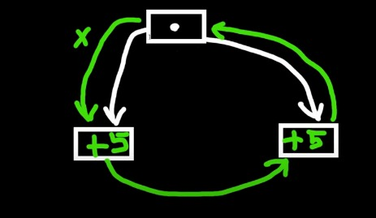
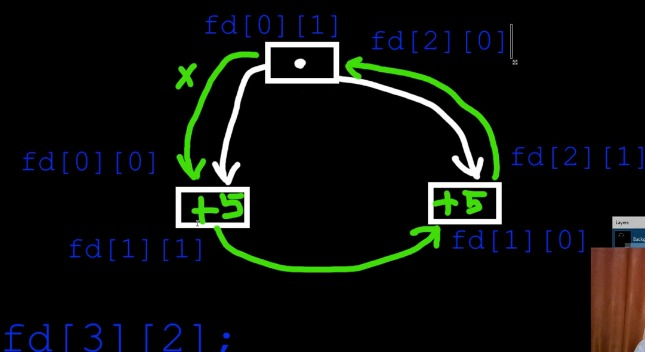

# EXO : 6

- l'objectif est de manipiluer plusieures pipes pour faire communiquer 3 processus :

    - processus parent a 2 fils fil1 te fil2 

    - processus parent envoie `ìnt x ` vers fil1 

    - fil1 faire l'opération `x+5` puis envoie le résulat vers fil2 

    - fil2 faire le méme opéartion que fil1 puis il envoie le résulat vers le parent 

    - le parent affiche les résulat final.

### Indication :

- **Attention:** aux descripteures des fichiers :

- **Extension :**

    - si sa marche par 3 processus c'est cool!!!

    - mnt on fait généraliser la démarche précedent pour n processus .