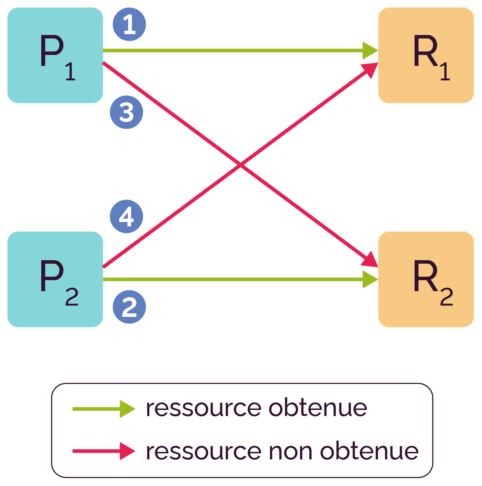

# cour 06 : **Interblocage:(deadlock)**


## 1. **Introduction:**

- **interblocage:** fait référence à une situation dans laquelle un ensemble de processus ou threads est bloqué indéfiniment, chacun attendant que les autres libèrent une ressource qu'ils détiennent, sans qu'aucun ne puisse progresser.


- Un **``deadlock``** est généralement caractérisé par quatre conditions nécessaires :

1. **Mutual Exclusion (Exclusion mutuelle) :** 
    
    - Au moins une ressource doit être détenue en mode exclusif. 
    - Cela signifie qu'un processus ou thread doit avoir un accès exclusif à la ressource.

2. **Hold and Wait (Attente passive) :** 
    
    - Un processus ou thread doit déjà détenir au moins une ressource et attendre pour en acquérir une autre que détient un autre processus ou thread.

3. **No Preemption (Non préemption) :** 
    
    - Les ressources ne peuvent pas être retirées de force à un processus ou thread qui les détient. Elles doivent être libérées volontairement.

4. **Circular Wait (Attente circulaire) :** 
    
    -Il doit exister une chaîne circulaire de processus ou threads dans laquelle chaque processus ou thread attend une ressource détenue par le suivant dans la chaîne.




La présence simultanée de ces quatre conditions crée un état où aucun processus ou thread ne peut avancer, car chacun attend quelque chose que les autres détiennent.


## 2. **Exemple Simple de Deadlock :**

- Considérons deux threads, A et B, et deux ressources, R1 et R2. 

- Si le thread A détient R1 et attend R2, et que le thread B détient R2 et attend R1, nous avons une situation de deadlock.

**Exemple de Code :**

```c
#include <pthread.h>

pthread_mutex_t mutex1 = PTHREAD_MUTEX_INITIALIZER;
pthread_mutex_t mutex2 = PTHREAD_MUTEX_INITIALIZER;

void *threadA(void *arg) {
    pthread_mutex_lock(&mutex1);
    // Effectuer des opérations avec R1
    pthread_mutex_lock(&mutex2);  // Attente passive pour R2
    // Effectuer des opérations avec R2
    pthread_mutex_unlock(&mutex2);
    pthread_mutex_unlock(&mutex1);
    return NULL;
}

void *threadB(void *arg) {
    pthread_mutex_lock(&mutex2);
    // Effectuer des opérations avec R2
    pthread_mutex_lock(&mutex1);  // Attente passive pour R1
    // Effectuer des opérations avec R1
    pthread_mutex_unlock(&mutex1);
    pthread_mutex_unlock(&mutex2);
    return NULL;
}

int main() {
    pthread_t tA, tB;

    pthread_create(&tA, NULL, threadA, NULL);
    pthread_create(&tB, NULL, threadB, NULL);

    pthread_join(tA, NULL);
    pthread_join(tB, NULL);

    return 0;
}
```

- Dans cet exemple, les threads A et B peuvent entrer dans un état de deadlock si les verrous sont acquis dans **l'ordre inverse**, ce qui crée une attente circulaire.
