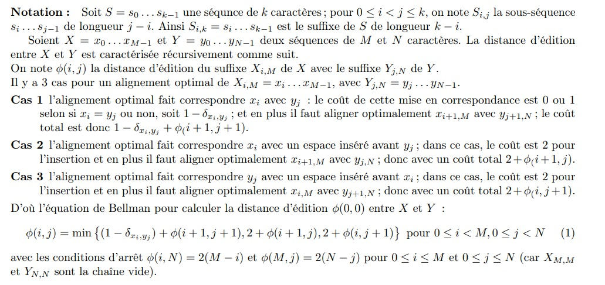

# projet_AOD

- **Date limite:**
	
	- date de rendu attendue : 27/10/2023 à 19h.

# Projet :  Alignement de séquences génétiques


## 1. L'objectif :

- Le but de ce projet est d’écrire un programme ``cache oblivious`` qui calcule l’alignement global optimal de
deux séquences génétiques (ADN) et d’analyser ses défauts de cache. 

- Ce calcul est réalisé par programmation dynamique (algorithme de Needleman-Wunsch).


## 2. Introduction à sujet :

### 2.1 Séquence génétique :

- chaque séquenec génetique contient :

    *  l’adenine (A), 
    * la cytosine (C), 
    * la guanine (G),
    *  la thymine (T) ,
    * l’uracile (U) .

-  étant donée un séquence d'ADN ` A A C A G T T A C C`  l'objectif est de comparer la séquenec avec des séquences déja étuide  par exemple ` T A A G G T C A`

- Si les deux séquences génétiques sont suffisamment similaires, on pourrait s’attendre à ce qu’elles aient des fonctions similaires.

- Une des méthodes utilisées pour mesurer la similarité de deux séquences génétiques est leur ``distance d’édition`` .


### 2.2 Distance d’édition :


- **a.Principe de calcul de distance d'édition :**

- Il s’agit d’aligner les deux séquences, i.e. les rendre égales, en s’autorisant :
    * à changer des caractères (en substituant un caractère par un autre dans une séquence)  
    
    * à insérer des espaces dans l’une ou l’autre (par exemple, pour qu’elles aient la même longueur). 
    
    * Un coût est payé pour chaque espace inséré et également pour chaque paire de caractères qui ne correspondent pas dans l’alignement final. :
        * insérer un espace : cout = 2
        * aligner deux caractères qui ne correspondent pas : cout = 1
        * aligner deux caractères qui correspondent        : cout = 0

- *La distance d’édition :* est le coût minimal parmi tous les alignements possibles entre deux séquences.


### 2.3  Caractérisation récursive de la distance d’édition :




### 2.4 Implémentation récursive de la distance d’édition


- Le programme ``distanceEdition.c`` fourni est une implémentation récursive avec mémoïsation de cette équation de Bellman 

 ```shell
make
	 	
./distanceEdition file1 b1 L1 file2 b2 L2
	

```
- Entrée :
	
	* deux noms de fichers de caractères file1 (contenant la séquence X) et file2 (contenant Y )

	* suivi de deux entiers b1 , L1 et b2 , L2 ; 
	
- Sortie :
	
	* il affiche sur la sortie standard la distance d’édition entre	$X_{b1 ,b1 +L1 −1}$ et $Y_{b2 ,b2 +L2 −1}$ (i.e. commençant au caractère bk de filek et de longueur Lk pour k = 1, 2).
